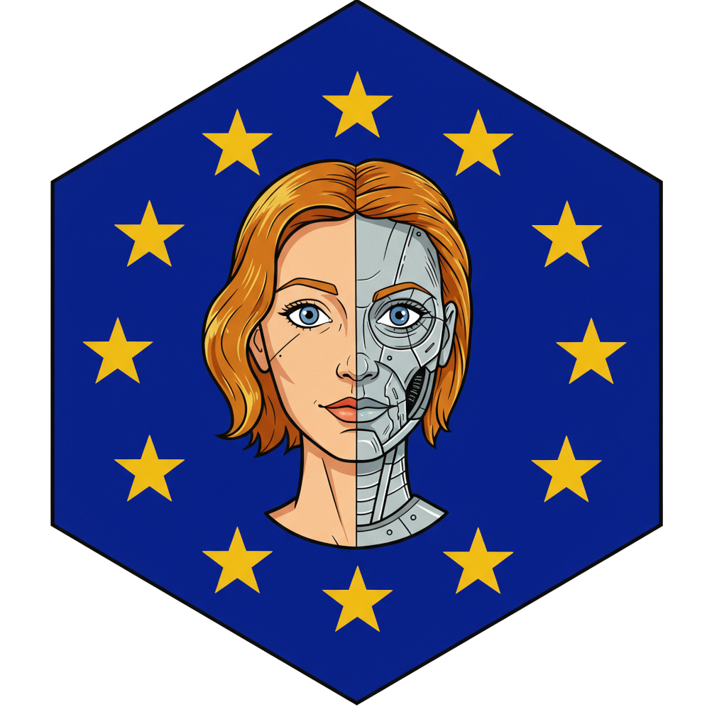

  

# AILEEN: AI Literacy & Education (for) Everyone, Now

## About this course

This course provides a comprehensive guide on Artificial Intelligence, with a primary focus on its ethical implications and compliance requirements. The contents fully cover the requlatory requirements of the EU AI Act with respect to AI Literacy. The course starts off by establishing foundational AI concepts, including how models learn and the critical role of training data. Building on this, the course illustrates significant ethical challenges such as AI bias, demonstrating how systems can inadvertently perpetuate societal stereotypes present in their training data.

The compliance segment thoroughly examines the relationship between AI and intellectual property, covering copyright issues related to AI training, output, and authorship. Furthermore, it addresses data protection concerns by detailing how AI processes personal data under regulations like GDPR, highlighting challenges in transparency and consent. The course culminates with an in-depth look at the EU AI Act, categorizing AI risks, defining key roles, and outlining essential legal requirements and prohibited uses for responsible AI deployment.
## Table of Contents

- [How to use this course](#how-to-use-this-course)
- [Tested Learn Management Platforms](#tested-learn-management-platforms)
- [Customizations](#customizations)
- [Acknowledgements](#acknowledgements)
- [License](#license)
- [Sources](#sources)
- [Image Credits](#image-credits)

## How to use this course

This course is available as a SCORM2004 learning module, one of the (still) most widely adopted standards in corporate e-learning. However, SCORM is also the most opinionated framework I ever worked with, so it might not work out of the box.

You can download the SCORM module here:

[scorm2004.zip](https://github.com/SebSchroen/aileen/raw/refs/heads/main/scorm2004.zip)

After downloading, you can upload it to your Learn Management Systems. You find a selection of tested systems below.

A preview is available here:

[https://sebschroen.github.io/aileen/](https://sebschroen.github.io/aileen/)

## Tested Learn Management Platforms

| Platform         | SCORM 1.2 | SCORM 2004 |
|------------------|-----------|------------|
| Knowledge Worker | ⛔️        | ✅         |
| Moodle           |           | ✅         |
| SCORM Cloud      | ✅        | ✅         |

## Customizations

As stated above, SCORM is highly opinionated and also outtated. Current LMS favor xAPI content. Since the adapt framework is highly customizable, contact me through the contact form on my homepage for customization requests, including additional languages.

## Acknowledgements

* In creating this course, I used the brilliant work of [Ignacio Cinalli ](https://github.com/nachocinalli). If you work with adapt, I really recommend his custom components. I will donate 10% of any revenue made with this course to him.

## License

This project is licensed under the [Creative Commons Attribution-ShareAlike 4.0 International License](LICENSE).

In short, this means you are free to:
* **Share** — copy and redistribute the material in any medium or format
* **Adapt** — remix, transform, and build upon the material for any purpose, even commercially.

Under the following terms:
* **Attribution** — You must give appropriate credit, provide a link to the license, and indicate if changes were made.
* **ShareAlike** — If you remix, transform, or build upon the material, you must distribute your contributions under the same license as the original.

### Disclaimer of Warranties and Limitation of Liability

THE SOFTWARE IS PROVIDED "AS IS", WITHOUT WARRANTY OF ANY KIND, EXPRESS OR IMPLIED, INCLUDING BUT NOT LIMITED TO THE WARRANTIES OF MERCHANTABILITY, FITNESS FOR A PARTICULAR PURPOSE AND NONINFRINGEMENT. IN NO EVENT SHALL THE AUTHORS OR COPYRIGHT HOLDERS BE LIABLE FOR ANY CLAIM, DAMAGES OR OTHER LIABILITY, WHETHER IN AN ACTION OF CONTRACT, TORT OR OTHERWISE, ARISING FROM, OUT OF OR IN CONNECTION WITH THE SOFTWARE OR THE USE OR OTHER DEALINGS IN THE SOFTWARE.

Sources

*   [Alan Turing Wikipedia](https://en.wikipedia.org/wiki/Alan_Turing)
*   Bolukbasi et al. (2016): Man is to Computer Programmer as Woman is to Homemaker? Debiasing Word Embeddings. DOI: [https://doi.org/10.48550/arXiv.1607.06520](https://doi.org/10.48550/arXiv.1607.06520)
*   Dewitte, Pierre (2025): AI Meets the GDPR. In: Smuha, N. A. (editor) (2025): The Cambridge Handbook of the Law, Ethics and Policy of Artificial Intelligence. DOI: [https://doi.org/10.1017/9781009367783.010](https://doi.org/10.1017/9781009367783.010)
*   EU AI Act Compliance Checker: [https://artificialintelligenceact.eu/assessment/eu-ai-act-compliance-checker/](https://artificialintelligenceact.eu/assessment/eu-ai-act-compliance-checker/) (Last accessed on 29.06.2025)
*   Guadamuz, Andres (2025): The EU's Artificial Intelligence Act and copyright, The Journal of World Intellectual Property Vol. 28(1). DOI: [https://doi.org/10.1111/jwip.12330](https://doi.org/10.1111/jwip.12330)
*   High-level summary of the EU AI Act: [https://artificialintelligenceact.eu/high-level-summary/](https://artificialintelligenceact.eu/high-level-summary/) (Last accessed on 29.06.2025)
*   Huawei Technologies (2023): Artificial Intelligence Technology. DOI: [https://doi.org/10.1007/978-981-19-2879-6](https://doi.org/10.1007/978-981-19-2879-6)
*   Legg, Shane; Hutter, Marcus (2007): Universal Intelligence: A Definition of Machine Intelligence. DOI: [https://doi.org/10.48550/arXiv.0712.3329](https://doi.org/10.48550/arXiv.0712.3329)
*   Paal, Boris P. (2022): Artificial Intelligence as a Challenge for Data Protection Law And Vice Versa. In: The Cambridge Handbook of Responsible Artificial Intelligence. DOI: [https://doi.org/10.1017/9781009207898.023](https://doi.org/10.1017/9781009207898.023)
*   Sag, Matthew (2023): Copyright Safety for Generative AI, Houston Law Review, Vol. 61(2). DOI (pre-print): [https://dx.doi.org/10.2139/ssrn.4438593](https://dx.doi.org/10.2139/ssrn.4438593)
*   Smuha, Nathalie A. (editor) (2025): The Cambridge Handbook of the Law, Ethics and Policy of Artificial Intelligence. DOI: [https://doi.org/10.1017/9781009367783](https://doi.org/10.1017/9781009367783)
*   Sousa Antunes et al. (2024): Multidisciplinary Perspectives on Artificial Intelligence and the Law. DOI: [https://doi.org/10.1007/978-3-031-41264-6](https://doi.org/10.1007/978-3-031-41264-6)
*   Stahl, Bernd; Schroeder, Doris & Rodrigues, Rowena (2023): Ethics of Artificial Intelligence. DOI: [https://doi.org/10.1007/978-3-031-17040-9](https://doi.org/10.1007/978-3-031-17040-9)
*   The AI Act Explorer: [https://artificialintelligenceact.eu/ai-act-explorer/](https://artificialintelligenceact.eu/ai-act-explorer/) (Last accessed on 29.06.2025)

Image Credits

*   **Images from Pexels.com:**
    *   Matterhorn photograph: [https://www.pexels.com/photo/white-mountain-under-gray-sky-267104/](https://www.pexels.com/photo/white-mountain-under-gray-sky-267104/)
    *   Woman blindfolded: Lil Artsy on [https://www.pexels.com/photo/woman-blindfolded-8730085/](https://www.pexels.com/photo/woman-blindfolded-8730085/)
    *   Robot pointing on a wall: Tara Winstead on [https://www.pexels.com/photo/robot-pointing-on-a-wall-8386440/](https://www.pexels.com/photo/robot-pointing-on-a-wall-8386440/)
    *   Typewriter with "ethics": Markus Winkler on [https://www.pexels.com/photo/a-typewriter-with-the-word-ethics-on-it-18498317/](https://www.pexels.com/photo/a-typewriter-with-the-word-ethics-on-it-18498317/)
    *   Golden balance scale beside a laptop: Ekaterina Bolovtsova on [https://www.pexels.com/photo/a-golden-balance-scale-beside-a-laptop-6077797/](https://www.pexels.com/photo/a-golden-balance-scale-beside-a-laptop-6077797/)
    *   European Commission flags on poles: Marco on [https://www.pexels.com/photo/european-commission-flags-on-poles-13153479/](https://www.pexels.com/photo/european-commission-flags-on-poles-13153479/)

*   **Images from Unsplash.com:**
    *   Traffic light in red: Erwan Hesry on [https://unsplash.com/photos/traffic-light-in-red-IqB5MPcQp6k](https://unsplash.com/photos/traffic-light-in-red-IqB5MPcQp6k)
    *   Blue flag on building: Christian Lue on [https://unsplash.com/photos/blue-flag-on-top-of-building-during-daytime-MZWBMNP7Nro](https://unsplash.com/photos/blue-flag-on-top-of-building-during-daytime-MZWBMNP7Nro)

*   **Diagrams from Sag (2023):**
    *   Diagram for "Substantial Similarity" ("Too Close for Comfort")
    *   Diagram for "Unauthorized Derivative Works" ("Building on Others' Creations")
    *   Diagram for "The Snoopy Problem" ("When AI 'Remembers'")
    *   Source: Sag, Matthew (2023): Copyright Safety for Generative AI, Houston Law Review. [https://houstonlawreview.org/article/92126-copyright-safety-for-generative-ai](https://houstonlawreview.org/article/92126-copyright-safety-for-generative-ai)

